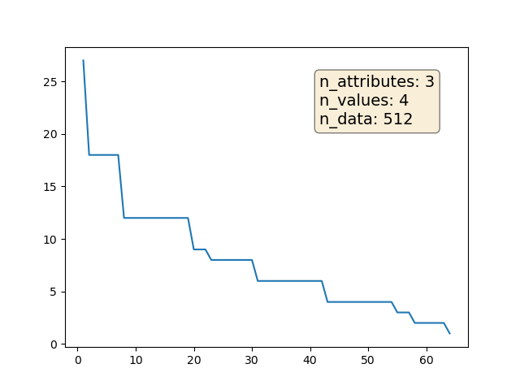
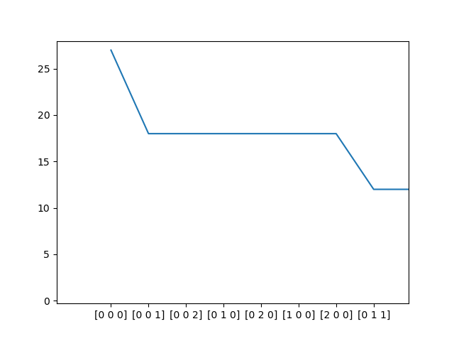
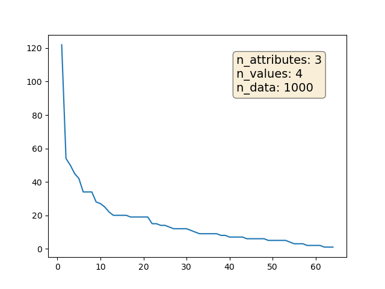
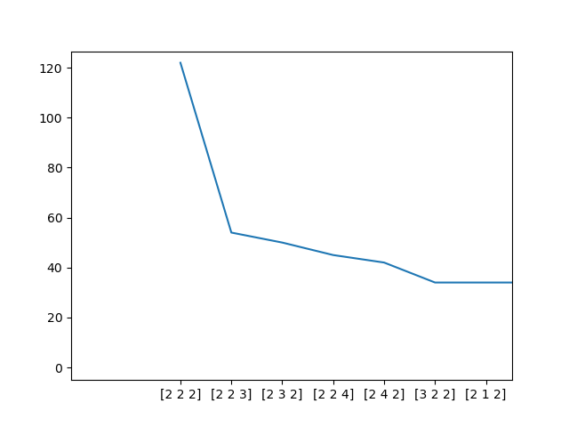
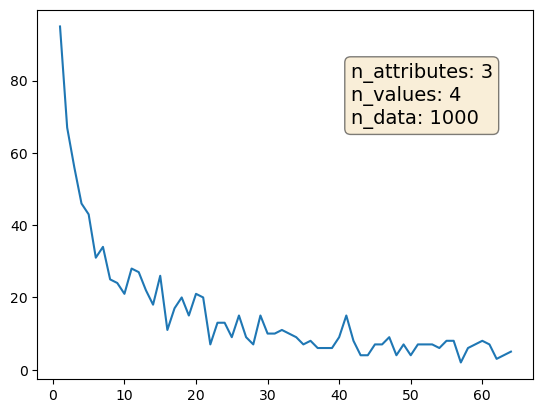
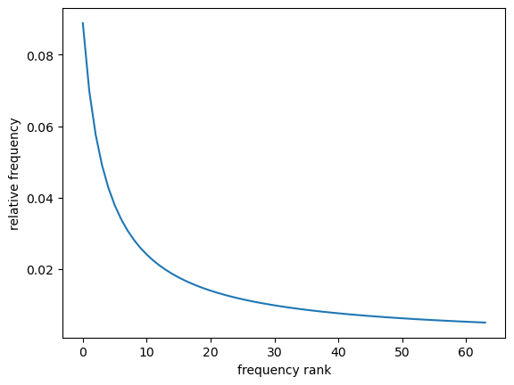
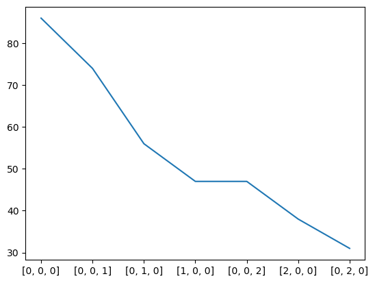

# Data
Generate artifical compositional data according to power law distributions. Train test split wrt. zero-shot compositionality. The figures below depict different ways of implementing a dataset, were both individual values ("local") as well as complete words ("global") are zipf-distributed.

## Local Zipf
The values for individual attributes are Zipf distributed. Afterwards these attributes are combined with each other as a cartesian product. This results in the distribution over the resulting Dataset to have plateaus when different codes have the same frequency rank (e.g. frequency-rank([1,2,3]) == frequency-rank([3,2,1]).

### absolute frequency as function of rank

### absolute frequency as function of actual codes, only partial for visibility reasons

## Global (unordered) Zipf
The overall dataset is Zipf distributed. Frequency ranks are not assigned wrt. specific symbols, though. Non-deterministic but n_dataset parameter because of sampling.

### absolute frequency as function of rank

### absolute frequency as function of actual codes, only partial for visibility reasons

## Global and ordered Zipf Distribution
This is the actually used Distribution (rest is legacy). The distribution is over the whole input space as opposed to invidual values. Ordering is still such that low values are more frequent than larger values (see bottom fig).

### absolute sampled frequency as function of rank

### relative frequency/probability as function of rank

### absolute frequency as function of actual codes, only partial for visibility reasons
